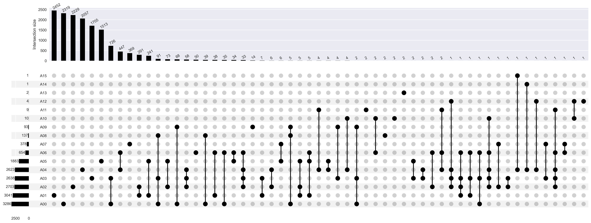
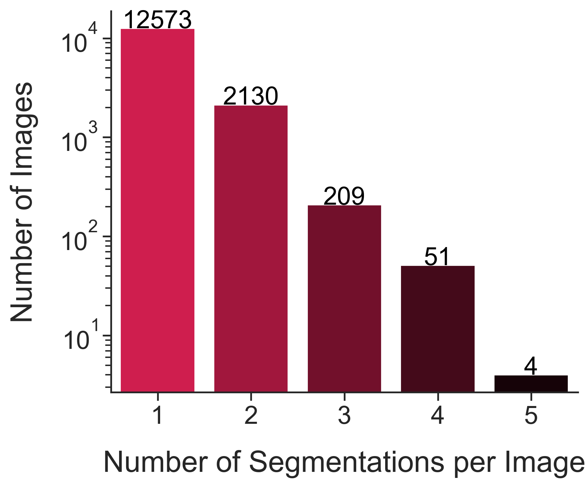

# IMA++

<!-- [](https://creativecommons.org/licenses/by-nc/4.0/) -->
[](https://github.com/astral-sh/ruff) [](https://arxiv.org/abs/2512.21472)
[](https://www.python.org/downloads/release/python-3100/)
[](https://doi.org/10.5281/zenodo.14201692)

> **TL;DR**: **ISIC MultiAnnot++** is the largest public skin lesion segmentation dataset, collected from the ISIC Archive, with **17,684 masks** for **14,967 images**, including **2,394 images with multiple annotations**, enabling research into inter-annotator agreement and segmentation preference modeling.

## Overview

**ISIC MultiAnnot++ (IMA++)** is a large-scale dermoscopic dataset designed to facilitate multi-annotator skin lesion segmentation research. Collected from [the ISIC Archive](https://www.isic-archive.com/), it contains **17,684 segmentation masks** across **14,967 images**. Notably, a subset of **2,394 images** features **2-5 segmentations per image** provided by **16 distinct annotators**. The dataset captures diverse segmentation styles influenced by annotator, tool choice, and skill level.

## Key Features

- **Inter-Annotator Variability**: Captures diverse segmentation styles driven by annotators (`A00`-`A15`), tool choice (`T1`-`T3`), and skill level (`S1`-`S2`).
- **Realistic Scenario**: Unlike most medical image segmentation datasets where every image is segmented by every annotator (i.e., a complete bipartite graph between annotators and images), IMA++ features an incomplete bipartite graph (i.e., every image is segmented by at least one annotator, but not all images are segmented by all annotators). This setup simulates real-world annotation scenarios where multiple annotators contribute to a subset of images.
- **Scale**: The largest public multi-annotator SLS dataset, enabling robust analysis of segmentation consistency and preference modeling.
- **Tool-Specific Styles**: Explicit metadata allows for analyzing how different annotation tools (`T1`-`T3`) influence segmentation boundaries.
- **Consensus Masks**: For the 2,394 images with multiple segmentations, we also provide two types of consensus masks: **STAPLE** (`ST`) and **majority voting** (`MV`).

## Data Access

The dataset (segmentation masks and metadata) is hosted on Zenodo. The raw images must be downloaded from the ISIC Archive.

### 1. Download IMA++ Segmentations
**[Download from Zenodo](https://doi.org/10.5281/zenodo.14201692)**
<!-- [](https://doi.org/10.5281/zenodo.14201692) -->

The Zenodo repository contains:
*   `segs.zip`: A ZIP archive of the 22,472 segmentation masks (original 17,684 + consensus labels).
*   `*_metadata.csv`: Rich metadata files for images and masks.
*   `iaa_metrics_*.csv`: Pre-computed inter-annotator agreement metrics.

### 2. Download Raw Images
The underlying RGB skin lesion images are not included in the Zenodo repository. You can use the ISIC API to download images by their ISIC ID using the code in [this GitHub repository](https://github.com/kakumarabhishek/ISIC-API-Image-Downloader).

## Repository Structure

```
IMAplusplus/
├── dataset_creation/          # Dataset creation and preprocessing
│   ├── create_dataset.py       # Creates dataset metadata and anonymizes annotators
│   ├── move_dataset.py         # Copies images and masks to target directory
│   ├── constants.py           # Tool and skill level mappings
│   └── config.yaml             # Configuration for dataset creation
│
├── dataset_analysis/           # Dataset quality assurance and visualization
│   ├── mask_qa.py              # Validates masks for quality issues
│   ├── other_datasets_overlap.py  # Visualizes overlap with other datasets
│   ├── imaplusplus_annotator_overlap.py  # Visualizes annotator overlap
│   └── config.yaml             # Configuration for analysis
│
├── multiannotator_analysis/    # Multi-annotator analysis and metrics
│   ├── create_multiannotator_subset.py  # Creates subset with multiple annotations
│   ├── create_consensus_masks.py        # Generates STAPLE and majority voting masks
│   ├── compute_IAA_metrics.py           # Computes inter-annotator agreement metrics
│   ├── compute_image_level_metrics.py  # Aggregates metrics per image
│   ├── visualization_scripts/          # Scripts for generating visualizations
│   └── config.yaml                     # Configuration for analysis
│
├── utils/                      # Utility functions
│   ├── data.py                 # Data loading utilities
│   ├── metrics.py              # Metric computation functions
│   └── md5.py                  # MD5 hash utilities
│
├── output/                     # Generated outputs
│   ├── metadata/               # CSV metadata files
│   ├── seg_masks/              # Segmentation masks
│   └── visualizations/         # Generated plots and figures
│
└── overall_script.sh          # Main pipeline script
```

<!-- ## Installation

### Dependencies

The codebase requires Python 3.x and the following packages:

```bash
pip install pandas numpy scikit-image SimpleITK medpy omegaconf loguru tqdm matplotlib upsetplot
```

Key dependencies:
- **pandas**: Data manipulation and CSV handling
- **numpy**: Numerical operations
- **scikit-image**: Image processing and mask operations
- **SimpleITK**: STAPLE consensus mask computation
- **medpy**: Medical image metrics (Dice, Jaccard, Hausdorff distance)
- **omegaconf**: Configuration management
- **loguru**: Logging
- **tqdm**: Progress bars
- **matplotlib**: Plotting
- **upsetplot**: UpSet plots for set visualization -->

## Usage

### Dependencies

```bash
pip install pandas numpy scikit-image SimpleITK medpy omegaconf loguru tqdm matplotlib upsetplot
```

### Quick Start

Run the complete pipeline using the provided script:

```bash
bash overall_script.sh
```

**Prerequisites**:
To run the full dataset creation pipeline, you need:
1.  **Raw ISIC Images**: Downloaded from ISIC Archive.
2.  **Raw ISIC Segmentations**: The original pool of segmentations (if not using the pre-packaged Zenodo release).
3.  **Metadata Mapping**: This repository includes the necessary mapping files in `dataset_creation/original_metadata_files/` to correctly map raw files to the IMA++ schema.

Configuration for input/output paths is handled in the `config.yaml` of each module.

### Individual Scripts

<details>
<summary>Click to expand Individual Scripts</summary>

#### Dataset Creation
(Only needed if reproducing the dataset construction from raw files)

```bash
cd dataset_creation/
python create_dataset.py  # Creates metadata from raw inputs
python move_dataset.py    # Renames and moves files to target structure
```

#### Dataset Analysis
Scripts to validate quality and visualize statistics.

```bash
cd dataset_analysis/
python mask_qa.py                        # Quality assurance (check for empty masks)
python other_datasets_overlap.py         # Generate overlap visualizations between IMA++ and other datasets (UpSet plot)
python imaplusplus_annotator_overlap.py  # Generate annotator interaction plots (UpSet plot)
```

#### Multi-annotator Analysis

```bash
cd multiannotator_analysis/
python create_multiannotator_subset.py  # Create multi-annotator subset
python create_consensus_masks.py        # Generate consensus masks
python compute_IAA_metrics.py          # Compute IAA metrics
python compute_image_level_metrics.py   # Aggregate metrics per image
```

</details>

## Configuration

<details>
<summary>Click to expand Configuration</summary>

Each module uses a `config.yaml` file for configuration. Key settings include:

- **Paths**: Source and target directories for images and masks
- **Metadata**: Paths to input and output metadata CSV files
- **Processing options**: Verbose logging, parallel processing settings

Example configuration structure:

```yaml
# dataset_creation/config.yaml
orig_imgs_dirs:
  jpg: ["/path/to/images/"]
orig_segs_dir: "/path/to/masks/"
raw_img_metadata_path: "./original_metadata_files/raw_ISIC_images_metadata.csv.gz"
raw_seg_masks_metadata_path: "./original_metadata_files/raw_ISIC_segmasks_metadata.csv"
target_data_dir: "/path/to/output/"
```

</details>

## Output Files

<details>
<summary>Click to expand Output Files</summary>

### Metadata Files

All metadata files are saved in `output/metadata/`:

- `IMAplusplus_seg_metadata.csv`: Complete segmentation metadata
- `IMAplusplus_img_metadata.csv`: Image metadata
- `IMAplusplus_multiannotator_subset_seg_metadata.csv`: Multi-annotator subset metadata
- `IMAplusplus_multiannotator_subset_IAA_metrics.csv`: Pairwise IAA metrics
- `IMAplusplus_multiannotator_subset_IAA_metrics_summary.csv`: Summary statistics
- `IMAplusplus_multiannotator_subset_image_level_metrics.csv`: Per-image aggregated metrics
- `IMAplusplus_seg_metadata_qa_results.csv`: Quality assurance results

### Segmentation Metadata Schema

Each segmentation mask has the following metadata:

- `ISIC_id`: ISIC image identifier
- `img_filename`: Image filename
- `seg_filename`: Segmentation mask filename
- `annotator`: Anonymized annotator ID (`A00`, `A01`, ..., `A15`)
- `tool`: Segmentation tool (`T1`: manual pointlist, `T2`: unknown, `T3`: autofill)
- `skill_level`: Annotator skill level (`S1`: expert, `S2`: novice)
- `mskObjectID`: Original mask object ID
- `mask_md5`: MD5 hash of the mask file

### Consensus Masks

For images with multiple annotations, two consensus masks are generated:

- **STAPLE** (`*_ST_ST_ST_ST.png`): STAPLE algorithm consensus
- **Majority Voting** (`*_MV_MV_MV_MV.png`): Majority voting consensus

### Inter-annotator Agreement Metrics

The following metrics are computed for all pairwise mask comparisons:

**Overlap Metrics:**
- Dice coefficient
- Jaccard coefficient

**Boundary Metrics:**
- Hausdorff distance (HD)
- 95th percentile Hausdorff distance (HD95)
- Average symmetric surface distance (ASSD)
- Normalized versions (by image diagonal length)

</details>

<!-- ## Key Features

### Annotator Anonymization

Annotators are anonymized to IDs (A00, A01, ...) based on the number of segmentations they produced, sorted in decreasing order.

### Tool and Skill Level Mapping

- **Tools**: 
  - T1: Manual pointlist
  - T2: Unknown/unspecified
  - T3: Autofill

- **Skill Levels**:
  - S1: Expert
  - S2: Novice

### Quality Assurance

The `mask_qa.py` script validates masks for:

- Missing or corrupted files (high severity)
- Empty masks (high severity)
- Masks covering entire image (high severity)
- Disconnected regions (medium severity)
- Masks touching image borders (low severity)

### Parallel Processing

Many scripts support parallel processing for improved performance:

- MD5 hash calculation
- Mask validation
- IAA metric computation -->

## Visualizations

The repository includes scripts to generate insightful visualizations of the dataset characteristics.

### Annotator Overlap
The distribution of segmentations across 16 annotators is long-tailed, with complex intersections.



### Dataset Statistics
Distribution of number of segmentations per image and factor-wise counts (Annotator, Tool, Skill).



## Citation

If you use the IMA++ dataset in your research, please cite the following papers:

Abhishek, K., Kawahara, J., Hamarneh, G. (2025). Segmentation Style Discovery: Application to Skin Lesion Images. In: Medical Image Computing and Computer-Assisted Intervention (MICCAI) ISIC Skin Image Analysis Workshop (MICCAI ISIC). MICCAI 2024. Lecture Notes in Computer Science, vol 15274, pages 24–34. Springer, Cham. https://doi.org/10.1007/978-3-031-77610-6_3

Abhishek, K., Kawahara, J., Hamarneh, G. (2025). What Can We Learn from Inter-Annotator Variability in Skin Lesion Segmentation?. In: Medical Image Computing and Computer-Assisted Intervention (MICCAI) ISIC Skin Image Analysis Workshop (MICCAI ISIC). MICCAI 2025. Lecture Notes in Computer Science, vol 16149, pages 23–33. Springer, Cham. https://doi.org/10.1007/978-3-032-05825-6_3

The BibTeX entries for these papers are:

```bibtex
@InProceedings{abhishek2024segmentationstyle,
    author = {Abhishek, Kumar and Kawahara, Jeremy and Hamarneh, Ghassan},
    title = {Segmentation Style Discovery: Application to Skin Lesion Images},
    booktitle = {Proceedings of the International Conference on Medical Image Computing and Computer-Assisted Intervention (MICCAI) ISIC Skin Image Analysis Workshop},
    pages = {24--34},
    year = {2025},
    doi = {https://doi.org/10.1007/978-3-031-77610-6_3},
    url = {https://link.springer.com/chapter/10.1007/978-3-031-77610-6_3},
    publisher = {Springer Nature Switzerland},
    address = {Cham},
    isbn = {9783031776106}
}

@InProceedings{abhishek2024variability,
    author = {Abhishek, Kumar and Kawahara, Jeremy and Hamarneh, Ghassan},
    title = {What Can We Learn from Inter-Annotator Variability in Skin Lesion Segmentation?},
    booktitle = {Proceedings of the International Conference on Medical Image Computing and Computer-Assisted Intervention (MICCAI) ISIC Skin Image Analysis Workshop},
    pages = {23--33},
    year = {2025},
    doi = {https://doi.org/10.1007/978-3-032-05825-6_3},
    url = {https://link.springer.com/chapter/10.1007/978-3-032-05825-6_3},
    publisher = {Springer Nature Switzerland},
    address = {Cham},
    isbn = {9783032058256}
}
```

